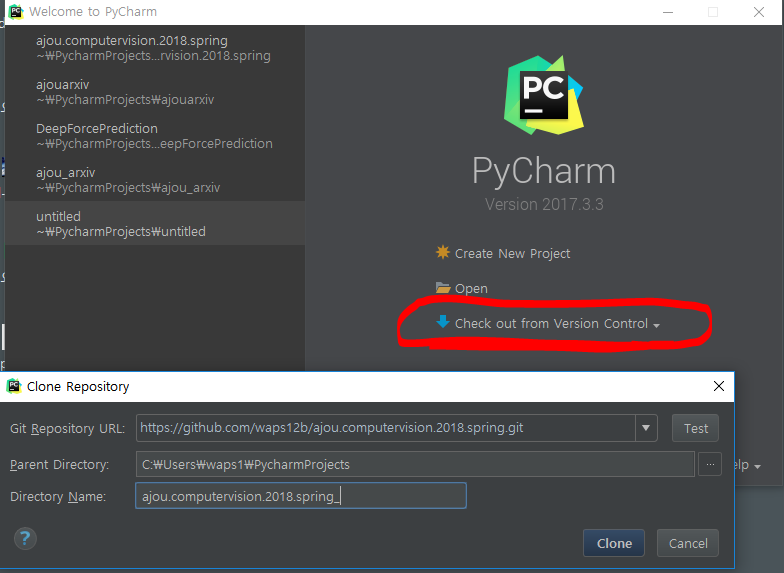
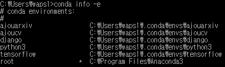
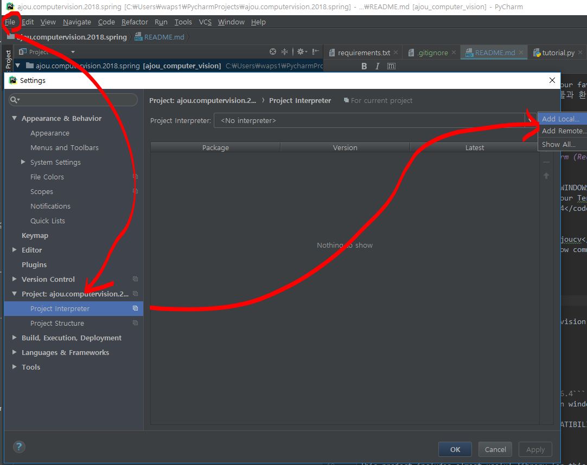
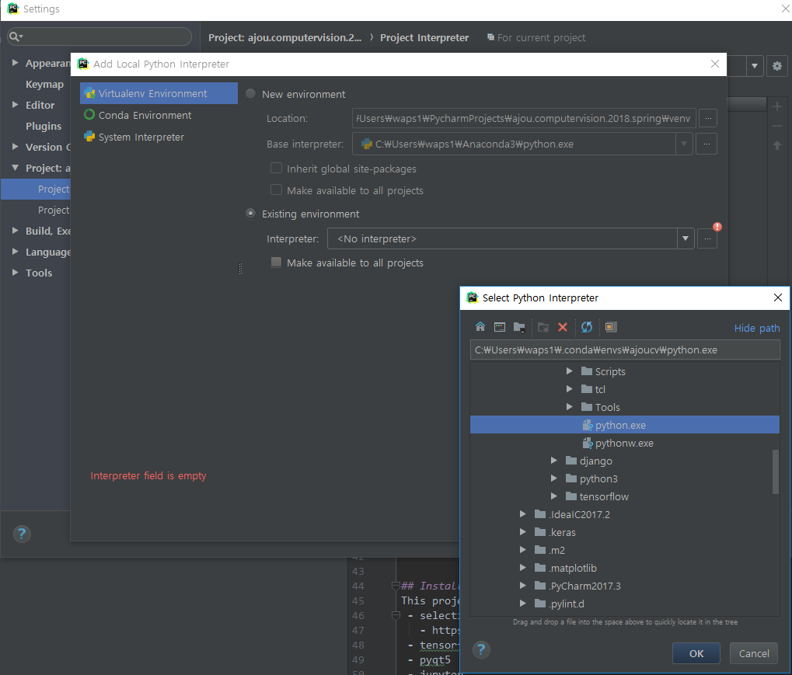
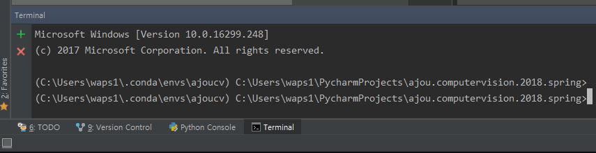

# Basic Python Tutorial for AjouCV

If you are already familiar with Python, use your favorite environments and tools. **But same versions of python and libraries are recommended for reducing compatibility problem between students and professor and TA.**
- 이미 파이썬에 익숙하신 분이라면 본인에게 편한 툴과 환경을 사용해도 무관합니다. 하지만 되도록이면 파이썬이나 라이브러리 버전은 본 환경과 통일하기를 권장합니다. 채점 과정에서 버전으로 인해 발생하는 문제를 최소화하기 위함입니다.

When you use your own favorite environment and tools that we didn't recomend, ***DO NOT ASK*** ABOUT YOUR VERSION AND COMPATIBILITY OF OS, PYTHON, IDE and ETC...
- ~~It's your own problem.~~ 


## Environment Setting using Anconda and PyCharm (Recommended)
1. ~~Install Newest Anaconda (Mandatory)~~ (파이참을 사용합시다!)
    - https://www.anaconda.com/download/
    - DO NOT ALLOW ADMINISTRATOR PRIVILEGE IN WINDOWS INSTALL WIZARD.
2. ~~Create your python virtual environment in your Termianl or CMD~~
    ```
    conda update anaconda
    conda create -n ajoucv python=3.6
    ```
3. Install PyCharm IDE
    - https://www.jetbrains.com/pycharm/
    - Run your pycharm 
  
4. Import Skeleton Project from GitHub.
    - https://github.com/waps12b/ajou.computervision.2018.spring.git
    - 

5. Set <code>ajoucv</code> environment as your project interpreter.
    - you can find the path of your virtual env interpreter in the command console.
        - <code>conda info -e</code>
        - 
    - Open **Project Setting** and change interpreter setting like below.
        - File > Settings  > Project > Project Interpreter > Add Local 
        - 
        - 
6. If you followed correctly, You can see the virtual environment path in your terminal.
    - 
7. Install libraries and their dependencies.
    ```
    pip install --upgrade pip
    pip install -r requirements.txt
    ```


## Installed Library
This project includes almost useful libraries for Computer Vision Project. You can freely choose and use some of them in your projects and assignments. Of course, You can install others.
 - selective search
   - https://github.com/AlpacaDB/selectivesearch
 - tensorflow 1.4.0
 - pyqt5
 - jupyter
 - keras
 - pycv2
 - numpy
 - scipy
 - scikit-learn
 - scikit-image
 - pandas
 - mglearn
 - matplotlib
 - pillow
 - ... 
 
